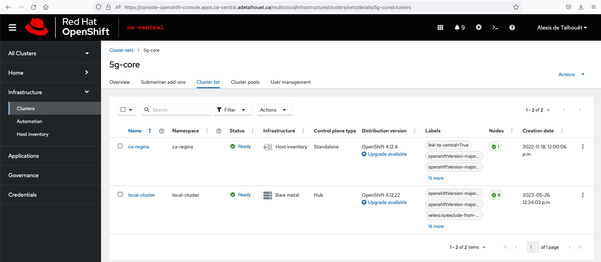
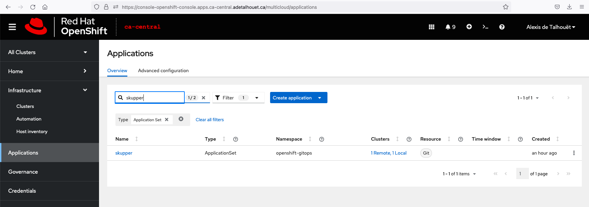
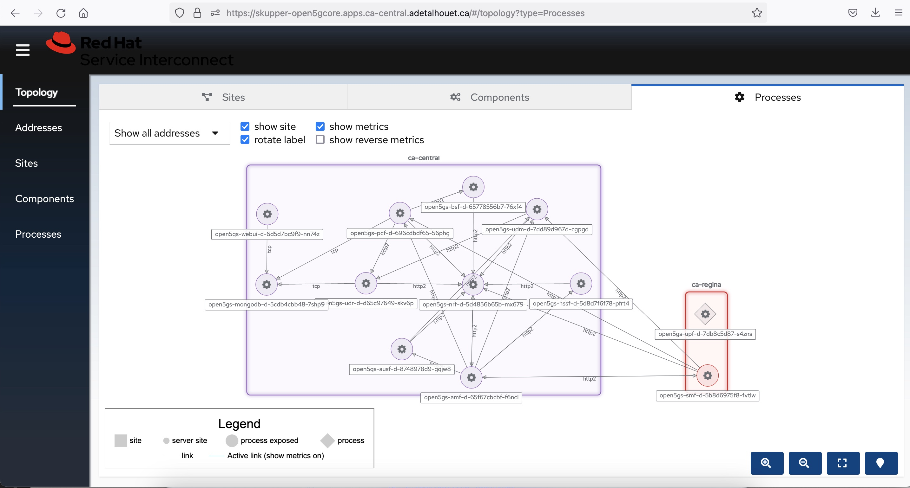

Note - this work is a fork and adaptation of Fatih Nar's repo: https://github.com/fenar/cnvopen5gcore

# Distributed 5G Core using Skupper on Red Hat Openshift

The goal is to distribute the user plane and have the control plane centralized. As such, we have two clusters, one containing SMF and UPF, and the other one containing the rest of the 5G Core.

In the central location, called `local-cluster`, we will expose:
- UDM
- PCF
- AMF
- NRF

In the remote location, called `ca-regina`, we will expose:
- SMF

## Prerequisites

- OpenShift 4.9
- Advanced Cluster Management 2.4
- OpenShift GitOps on the cluster where ACM is
- Two clusters that are imported into ACM (can be the local-cluster and another one)
- SCTP enabled on both clusters
    ```
    oc create -f enablesctp.yaml
    ```
    Wait for machine config to be applied on all worker nodes and all worker nodes come back in to ready state.

## Create a managed cluster set

Apply the following label to the two identified clusters: `5g-core: "True"` following [this documentation](https://access.redhat.com/documentation/en-us/red_hat_advanced_cluster_management_for_kubernetes/2.4/html/clusters/managing-your-clusters#managing-cluster-labels)


Create a managed cluster set, along with binding and a cluster placement. The cluster `Placement` object will target any cluster matching the label created above.
Finally, leverage the placement rule to import the managed clusters into ArgoCD using `GitOpsCluster` CR.
~~~
oc apply -f managed-cluster-set.yaml
~~~

Here is the resulting cluster set created in ACM, along with our two clusters part of it.


In ArgoCD, we can see both `local-cluster` and `ca-regina` clusters have been successfully imported.


## Deploying Skupper

Skupper connects clusters to a secure layer 7 network. It uses that network to forward local service traffic to remote clusters. For that, it requires a router in each cluster to properly foward the traffic in and out. In our scenario, we will expose some of the 5G Core services to Skupper in order to have them reachable across clusters.

To establish a secure link, Skupper can use an empty secret labelled `skupper.io/type: connection-token-request`. The operator will populate the Certificate Authority, along with a Certificate and its Key in this secret.
That secret, containing the security details to establish the link, needs to be imported to the remote site.
To do so, we are using ACM deployables functionality: we are basically creating a `Channel`, a `Subscription` and a `PlacementRule` that will look for `Secret` objects containing this annotation `apps.open-cluster-management.io/deployables: "true"` and will ensure each cluster matching the defined `PlacementRule` will have a copy of that secret.

In order to establish the layer 7 link, we will use an `ApplicationSet` using the same cluster placement as defined in previous step. ArgoCD will render an `Application` per cluster.
Note: the `selfHeal` feature is disabled because the Skupper operation will modify the secret to populate additional information. If it is enabled, Argo will continuously erase the security details provided by Skupper, and the link won't come up.

To perform all the above, appy the following manifest
~~~
oc apply -f skupper/skupper-acm-appset.yaml
~~~

Once done, you should see this in ACM


And you can browse to Skupper UI; retrieve the route using `oc get routes -n open5gcore skupper`

You should have two sites registered


And have the link up between the two sites


## Deploying Open5GS

Similarly as Skupper deployment, we will use an `ApplicationSet` using the same cluster placement as defined in the first step, and let Argo render `Application`.
In order to defined what part of the 5G Core will be deployed in each cluster, we are using a Helm chart and are customizaing the values.yaml file for each cluster, identified using `{{cluster-name}}-values.yaml`.

Install the application set as follow
~~~
oc apply -f 5gcore/distributed-5gcore-acm-appset.yaml
~~~

Once the deployment is done, you should see the following in ACM


As part of the deployment, we are exposing services to Skupper to make them reachable through the L7 link created before.

And you should see the services exposed through Skupper UI


## Provision the user equipment

The Open5GS project comes with a webui that allows you to register UE. As such, log in the UI to register the UE.

Retrieve the webui URL with `oc get route -n open5gcore webui` and login using the following credentials
- username: admin
- password: 1423

Click "Add new subscriber" and in the `IMSI` field enter `208930000000001`. The rest of the values have been configured automatically.

## Deploy the gNB and the UE

In order for the gNB to establish its SCTP session with AMF, it requires the AMF service IP. As such, update the values.yaml file in the 5gran folder.
It can be retrieved using
~~~
oc get service -n open5gcore amf-open5gs-sctp -o jsonpath={.spec.clusterIP}
~~~

Once updated properly, apply the below manifest to create the argo application OR
~~~
oc apply 0f 5gran/5gran-app.yaml
~~~

OR Deploy the helm chart manually
~~~
helm install 5gran
~~~

Once deployed, look at the logs of gNB and UE to validate the PDU session has properly be established


Finally, see bellow the overall interaction within Skupper



## Links
- https://open5gs.org/
- https://github.com/open5gs/open5gs
- https://github.com/aligungr/UERANSIM